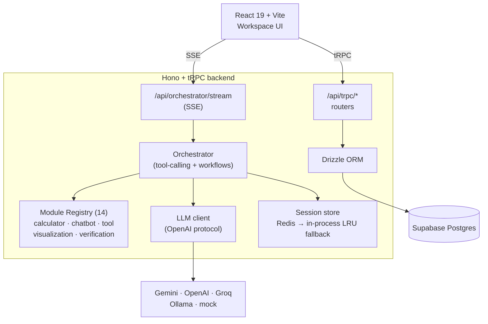

# EVAI Ecosystem Platform (`xabai/app`)

> A unified, context-aware **AI operating layer** that absorbs calculators, chatbots, productivity tools and verification modules into a single workspace with a shared LLM orchestrator, persistent session memory, and pluggable modules.

Built end-to-end in **TypeScript** on React 19 + Vite + Hono + Drizzle ORM, with optional Supabase Postgres, Redis, and a Python sidecar for Voice Verification.

---

## Table of contents

- [Quick start](#quick-start)
- [Overview](#overview)
- [High-level architecture](#high-level-architecture)
- [The three interaction modes](#the-three-interaction-modes)
- [Tech stack](#tech-stack)
- [Project structure](#project-structure)
- [Module registry](#module-registry)
- [Adding a new module](#adding-a-new-module)
- [Getting started](#getting-started)
- [Environment variables](#environment-variables)
- [npm scripts](#npm-scripts)
- [API surface (tRPC)](#api-surface-trpc)
- [Database](#database)
- [LLM providers](#llm-providers)
- [Demo login](#demo-login)
- [Docker](#docker)
- [Project phases](#project-phases)
- [Security & production checklist](#security--production-checklist)
- [Contributing](#contributing)
- [Troubleshooting](#troubleshooting)

---

## Quick start

```bash
# 1. Install
npm install

# 2. Minimum viable .env
cat > .env <<'EOF'
APP_ID=eva7-local
APP_SECRET=replace-with-a-long-random-string
EOF

# 3. Dev server on http://localhost:3000
npm run dev
```

Log in with **`demo@evai.nl` / `demo123`**, navigate to `/workspace`, and chat: _"Bereken mijn netto inkomen bij €100k omzet en €15k kosten"_.

Without an LLM key the mock client still triggers the ZZP calculator so you can see the full tool-calling pipeline end-to-end. To use a real model, set `LLM_PROVIDER` + `LLM_API_KEY` — see [LLM providers](#llm-providers).

---

## Overview

EVAI is an **AI operating system for tools** — not a website. It exposes one chat-driven workspace where an LLM orchestrator can invoke any registered "module" (calculator, chatbot, tool, visualization, verification) as a typed function call, with results flowing into a shared session context that persists across tool invocations.

Highlights:

- **Auto-discovery module registry** (`api/modules/*` + `src/modules/*`) — drop a folder, register the manifest, and the module is instantly available to the LLM, the Module Browser UI, and the Direct Tool mode.
- **Streaming SSE orchestrator** with OpenAI-compatible tool calling, multi-step workflow tracking, and `@variable` reference resolution in user messages.
- **Three first-class interaction modes** rendered from one Workspace shell.
- **Type-safe end-to-end** via Zod schemas shared between client/server through tRPC.
- **Graceful offline degradation**: no DB / no Redis / no Supabase → in-memory sessions + localStorage Documents & Organogram. Ship the demo, wire infra later.

---

## High-level architecture



<details>
<summary>Plain-text fallback</summary>

```
  React 19 + Vite  ──tRPC──►  Hono routers  ──►  Drizzle ORM  ──►  Supabase Postgres
  Workspace UI     ──SSE───►  Orchestrator  ──►  Module Registry (14)
                                     │
                                     ├──►  LLM client  ──►  Gemini / OpenAI / Groq / Ollama / mock
                                     └──►  Session store (Redis → in-process LRU fallback)
```

</details>

### Request flow on a chat message

1. `ChatStream` POSTs the user message to `/api/orchestrator/stream` (SSE).
2. The orchestrator resolves `@variable` references from session context, then opens an OpenAI-compatible `chat/completions` stream with the available modules exposed as **tools**.
3. The LLM streams tokens back; when it emits a `tool_call`, the orchestrator executes the matching skill in `api/modules/<id>/skill.ts`.
4. The skill returns a `SkillResult` with optional `contextDelta` → variables + history are merged into the session.
5. The tool result is fed back into the LLM, which streams the final answer to the client.
6. `workflow.*` events are emitted so `ContextViewer` can render the live timeline.

---

## The three interaction modes

The Workspace page (`src/pages/Workspace.tsx`) hosts all three modes, switched via the top-bar `ModeSwitcher`.

| Mode | Slug | What it does |
|---|---|---|
| **1. Chat with Calculators** | `chat-calculators` | LLM can call any registered calculator module as a tool (ZZP, VVC, Mining, Estate). |
| **2. Chat with Projects** | `chat-projects` | LLM can call chatbots, productivity tools, visualizations, and verification modules (TGC, Takenblok, Hellings, Loep, VVC, Ecosysteem). |
| **3. Direct Tool** | `direct-tool` | User picks one module and interacts with its full UI panel directly — no LLM in the middle. |

The orchestrator's `MODE_TO_TYPES` mapping enforces which module types are exposed per mode.

---

## Tech stack

| Layer | Technology |
|---|---|
| Frontend | React 19, TypeScript, Vite 7, TailwindCSS 3, Radix UI / shadcn-style components, lucide-react |
| State / Data | TanStack Query, tRPC client, React Router 7 |
| Backend | Hono on Node (`@hono/node-server`), tRPC server, SSE streaming |
| ORM | Drizzle ORM (PostgreSQL dialect via `postgres` driver) |
| DB | Supabase Postgres (Transaction Pooler, port 6543) — optional |
| Auth | JWT via `jose`, httpOnly cookie session, demo login active |
| Validation | Zod (shared client/server via tRPC) |
| Charts | Recharts |
| Forms | react-hook-form + @hookform/resolvers |
| Realtime | SSE for orchestrator token streaming |
| Cache / Sessions | Redis via `ioredis` (optional, falls back to in-process LRU) |
| Build | Vite for client, esbuild for server bundle |
| Test | Vitest |

---

## Project structure

```
app/
├── api/                          # Hono + tRPC backend
│   ├── boot.ts                   # Server entry (Hono app + SSE handler)
│   ├── router.ts                 # Root tRPC router
│   ├── auth-router.ts            # Login / logout / me (demo login)
│   ├── modules-router.ts         # Module manifest endpoints
│   ├── sessions-router.ts        # Session create / setMode / setActiveModule
│   ├── tools-router.ts           # Tool registry + execution
│   ├── workspace-router.ts       # Documents & Organogram CRUD
│   ├── work-router.ts            # Work items
│   ├── agenda-router.ts          # Calendar / events
│   ├── notifications-router.ts   # Notifications
│   ├── lib/                      # env, auth, cookies, http, vite static
│   ├── kimi/                     # Session token signing
│   ├── middleware/               # Rate limit
│   ├── orchestrator/             # LLM orchestrator
│   │   ├── index.ts              # Workflow engine + variable parser
│   │   ├── llm-client.ts         # OpenAI-compatible + mock client
│   │   └── sse-handler.ts        # SSE streaming endpoint
│   └── modules/                  # Backend module skills (12 modules)
│       ├── _registry.ts
│       ├── zzp-netto-calculator/ # { schema, skill, manifest }
│       ├── vvc-calculator/
│       ├── tgc-chatbot/
│       ├── organogram/
│       ├── … (8 more)
│
├── src/                          # React frontend
│   ├── App.tsx                   # Routes
│   ├── main.tsx                  # Entry
│   ├── pages/                    # Dashboard, Workspace, Tools, Organigram, Agenda, …
│   ├── components/
│   │   ├── orchestrator/         # ChatStream, ContextViewer, ModeSwitcher, ModuleBrowser
│   │   ├── documents/            # DocumentsPanel + tabs
│   │   ├── layout/               # Sidebar + AuthLayout
│   │   └── ui/                   # shadcn-style primitives (50+ components)
│   ├── modules/                  # Frontend module panels (mirror of api/modules)
│   │   ├── _registry.ts          # Lazy-loaded panels + context cards
│   │   └── <module>/             # { Panel.tsx, ContextCard.tsx, manifest.ts }
│   ├── hooks/                    # useOrchestrator, useAuth, …
│   ├── providers/                # TRPCProvider
│   └── lib/                      # supabase client, utils
│
├── contracts/                    # Shared Zod schemas + TS types
│   ├── llm.ts                    # LLMClient, ChatRequest, ChatChunk, ToolCall
│   ├── module-manifest.ts        # ModuleManifest + InteractionMode
│   ├── session-context.ts        # SessionContext, Workflow, History
│   ├── skill.ts                  # Skill interface
│   └── constants.ts
│
├── db/
│   ├── schema.ts                 # Drizzle schema (users, sessions, modules, docs, organogram, …)
│   ├── seed.ts                   # Seed data
│   └── migrations/               # SQL migrations (hand-written for Supabase)
│
├── public/                       # Static assets
├── Dockerfile                    # Multi-stage build (deps → build → production)
├── docker-compose.yml            # app + mysql + redis + ollama + python-services
├── drizzle.config.ts             # Drizzle Kit config (PostgreSQL)
├── vite.config.ts                # Vite + Hono dev server
├── .env.example                  # Reference for required env vars
└── package.json
```

---

## Module registry

Every module is a self-contained folder that ships:

1. **Backend skill** (`api/modules/<id>/`): `schema.ts` (Zod input/output), `skill.ts` (execution logic), `manifest.ts` (typed `ModuleManifest`).
2. **Frontend manifest** (`src/modules/<id>/`): `Panel.tsx` (full UI), `ContextCard.tsx` (history card), `manifest.ts` (frontend metadata, lazy import).

Both registries (`api/modules/_registry.ts` and `src/modules/_registry.ts`) eagerly import every module at boot; [adding a new one](#adding-a-new-module) takes ~3 files and two import lines.

### Current modules (12 registered, all functional)

| # | Module | Type | Status |
|---|---|---|---|
| 1 | ZZP Netto Calculator | calculator | ✅ NL tax 2025 (zelfstandigenaftrek, MKB, ZVW) |
| 2 | VVC Calculator | calculator | ✅ Sliders + project earnings chart |
| 3 | Mining Calculator | calculator | ✅ Streaming revenue (Spotify/Apple/YouTube + Apple-Mini farm) |
| 4 | Estate Calculator | calculator | ✅ Vastgoed-vliegwiel simulatie met cashflow steps |
| 5 | TGC Chatbot | chatbot | ✅ Multilingual cashflow expert |
| 6 | VVC Chatbot | chatbot | ✅ Knowledge base lookup (verdienmodel, cultuur, Double Team) |
| 7 | Ecosysteem Chatbot | chatbot | ✅ Meta-router naar de juiste module per onderwerp |
| 8 | Organogram | visualization | ✅ Query + CRUD over bedrijfsstructuur |
| 9 | Takenblok | tool | ✅ Kanban (4 kolommen) gevoed door work-router |
| 10 | Visualization | visualization | ✅ Line/bar/area chart builder (Recharts) |
| 11 | Verification | verification | ✅ KYC-style heuristieken (document, leeftijd, naam, land) |
| 12 | Voice Verification | verification | ✅ Live waveform + mock confidence (Python sidecar via `PYTHON_BRIDGE_URL`) |

Every module ships a typed Zod schema, a backend skill that emits progress events and persists context variables, plus a frontend Panel for direct-tool interaction. Voice Verification falls back to a deterministic mock when no Python sidecar is configured.

---

## Adding a new module

A module is a pair of folders with a small, typed contract. The pieces are defined in `contracts/`:

- **Manifest** (`ModuleManifest` — `contracts/module-manifest.ts`): id, type, version, capabilities, UI metadata, runtime.
- **Skill** (`Skill` — `contracts/skill.ts`): `{ manifest, capabilities: Record<string, handler> }` where each handler returns a `SkillResult` with optional `contextDelta`.
- **Frontend manifest** (`FrontendModuleManifest` — `src/modules/_types.ts`): lazy `panel` + optional `contextCard` imports.

### Step-by-step

**1. Backend — `api/modules/my-module/schema.ts`**

```ts
import { z } from "zod";

export const MyInputSchema = z.object({
  amount: z.number().positive(),
});
export const MyOutputSchema = z.object({
  doubled: z.number(),
});
export type MyInput = z.infer<typeof MyInputSchema>;
export type MyOutput = z.infer<typeof MyOutputSchema>;
```

**2. Backend — `api/modules/my-module/manifest.ts`**

```ts
import { z } from "zod";
import type { ModuleManifest } from "../../../contracts/module-manifest";
import { MyInputSchema, MyOutputSchema } from "./schema";

export const manifest: ModuleManifest = {
  id: "my-module",
  name: "My Module",
  type: "calculator",
  version: "1.0.0",
  description: "Doubles a number. Replace with real logic.",
  tags: ["demo"],
  capabilities: [{
    name: "double",
    description: "Return 2x the input amount.",
    inputSchema: z.toJSONSchema(MyInputSchema),
    outputSchema: z.toJSONSchema(MyOutputSchema),
  }],
  contextOutputs: ["lastDoubled"],
  dependencies: [],
  ui: { icon: "Calculator", color: "#6366f1" },
  requiresAuth: true,
  permissions: [],
  runtime: "typescript",
};
```

**3. Backend — `api/modules/my-module/skill.ts`**

```ts
import type { Skill } from "../../../contracts/skill";
import { manifest } from "./manifest";
import { MyInputSchema } from "./schema";

export const skill: Skill = {
  manifest,
  capabilities: {
    double: async (raw) => {
      const input = MyInputSchema.parse(raw);
      const doubled = input.amount * 2;
      return {
        ok: true,
        data: { doubled },
        contextDelta: {
          variables: { lastDoubled: doubled },
          history: [{ moduleId: manifest.id, summary: `Doubled ${input.amount} → ${doubled}` }],
        },
        trace: [{ step: "double", ts: Date.now() }],
      };
    },
  },
};
```

**4. Frontend — `src/modules/my-module/Panel.tsx`, `ContextCard.tsx`, `manifest.ts`**

Follow the shape of an existing functional module, e.g. `src/modules/vvc-calculator/`. The frontend `manifest.ts` should look like:

```ts
import type { FrontendModuleManifest } from "../_types";

export const frontendManifest: FrontendModuleManifest = {
  id: "my-module",
  icon: "Calculator",
  color: "#6366f1",
  panel: () => import("./Panel"),
  contextCard: () => import("./ContextCard"),
};
```

**5. Register** — two one-line imports:

- `api/modules/_registry.ts`: add `import { skill as mySkill } from "./my-module/skill";` and push it into `allSkills`.
- `src/modules/_registry.ts`: add `import { frontendManifest as myManifest } from "./my-module/manifest";` and push it into `all`.

Restart the dev server. The module now:

- Appears in the **Module Browser** (left rail in `/workspace`).
- Is callable by the **LLM** in whichever mode matches its `type`.
- Is usable via the **Direct Tool** mode.
- Is invokable over tRPC via `modules.invoke({ moduleId: "my-module", capability: "double", input: { amount: 5 } })`.

---

## Getting started

### Prerequisites

- **Node.js 20+** (the Dockerfile pins `node:20-alpine`)
- **npm** (lockfile is `package-lock.json`)
- Optional: a **Supabase project** (for Postgres + Documents/Organogram CRUD)
- Optional: a **Redis server** (for persistent sessions)
- Optional: an **LLM API key** (OpenAI / Groq / Together / OpenRouter / Google Gemini) **or** a local **Ollama** install

### Install

```bash
npm install
```

### Configure environment

```bash
cp .env.example .env
# then edit .env — see the table below
```

The minimum to launch the app in **demo mode** is just:

```dotenv
APP_ID=eva7-local
APP_SECRET=any-long-random-string
```

Everything else falls back to mock / in-memory / localStorage.

### Run the dev server

```bash
npm run dev
```

Open <http://localhost:3000> and log in with the [demo credentials](#demo-login).

### Type-check & lint

```bash
npm run check    # tsc -b
npm run lint     # eslint .
npm run format   # prettier --write .
```

### Test

```bash
npm test         # vitest run
```

---

## Environment variables

Full reference (matches `.env.example`):

### Backend core

| Variable | Required | Description |
|---|---|---|
| `APP_ID` | yes | Application ID, used as JWT issuer. |
| `APP_SECRET` | yes (in prod) | JWT signing secret. Falls back to a demo key in dev. **Rotate before production.** |
| `DATABASE_URL` | optional | Supabase **Transaction Pooler** connection string (port `6543`). Required only for `drizzle-kit` and DB-backed routers. Format: `postgresql://postgres.<ref>:<password>@aws-0-<region>.pooler.supabase.com:6543/postgres`. |
| `KIMI_AUTH_URL` | optional | Legacy Kimi OAuth server URL (currently unused). |
| `KIMI_OPEN_URL` | optional | Legacy Kimi Open Platform URL (currently unused). |
| `OWNER_UNION_ID` | optional | `union_id` of the platform owner; receives `role=admin` on first login. |

### LLM orchestrator

| Variable | Required | Description |
|---|---|---|
| `LLM_PROVIDER` | optional | `openai` \| `ollama` \| _(empty for mock)_. |
| `LLM_API_KEY` | depends | API key for the OpenAI-compatible endpoint. |
| `LLM_MODEL` | optional | Model id (e.g. `gpt-4o-mini`, `gemini-2.5-flash`, `llama3.2`). |
| `LLM_BASE_URL` | optional | Override base URL. Examples: `https://api.groq.com/openai/v1`, `https://generativelanguage.googleapis.com/v1beta/openai`, `https://openrouter.ai/api/v1`. |
| `OLLAMA_HOST` | optional | Default `http://localhost:11434/v1` when `LLM_PROVIDER=ollama`. |

Without `LLM_PROVIDER` set, the orchestrator uses the built-in `MockLLMClient` which still demonstrates tool calling (it will invoke the ZZP calculator on keywords like "zzp" / "bereken" / "netto").

### Memory & sidecars

| Variable | Required | Description |
|---|---|---|
| `REDIS_URL` | optional | `redis://localhost:6379`. Without it, sessions live in an in-process LRU map. |
| `SESSION_TTL_HOURS` | optional | Defaults to `6`. |
| `PYTHON_BRIDGE_URL` | optional | `http://localhost:8001` — only required when the Voice Verification sidecar is enabled. |

### Frontend (exposed to the browser via Vite)

| Variable | Required | Description |
|---|---|---|
| `VITE_APP_ID` | optional | Mirror of `APP_ID` for the client. |
| `VITE_KIMI_AUTH_URL` | optional | Kimi OAuth server URL for the client (currently unused). |
| `VITE_SUPABASE_URL` | optional | `https://<project-ref>.supabase.co`. When empty, Documents + Organogram fall back to **localStorage offline mode**. |
| `VITE_SUPABASE_ANON_KEY` | optional | Supabase publishable / anon key. |

⚠️ **`.env` is gitignored** (`@.gitignore:26`) — never commit secrets. Use `.env.example` for non-secret references only.

---

## npm scripts

| Script | Purpose |
|---|---|
| `npm run dev` | Vite dev server on port `3000` with Hono backend hot-reload (`@hono/vite-dev-server`). |
| `npm run build` | Vite client build → `dist/public/` **and** esbuild server bundle → `dist/boot.js`. |
| `npm start` | Production server: `NODE_ENV=production node dist/boot.js`. |
| `npm run preview` | Vite production preview. |
| `npm run check` | TypeScript project-references check (`tsc -b`). |
| `npm run lint` | ESLint over the whole repo. |
| `npm run format` | Prettier write. |
| `npm test` | Vitest one-shot run. |
| `npm run db:generate` | `drizzle-kit generate` — emit migrations from `db/schema.ts`. |
| `npm run db:migrate` | `drizzle-kit migrate` — apply pending migrations. |
| `npm run db:push` | `drizzle-kit push` — push schema directly (dev only). |

> All `db:*` scripts require a valid `DATABASE_URL`.

---

## API surface (tRPC)

All endpoints live under `/api/trpc/<router>.<procedure>`. The root router is assembled in `api/router.ts`.

| Router | Key procedures |
|---|---|
| `ping` | `ping()` – health check, returns `{ ok, ts }`. |
| `auth` | `login({ email, password })`, `logout()`, `me()` – JWT cookie session. |
| `sessions` | `create({ mode })`, `get`, `list`, `setMode`, `setActiveModule`, `delete`. |
| `modules` | `list({ type? })`, `get({ moduleId })`, `invoke({ moduleId, capability, input, sessionId? })`. |
| `tools` | Tool registry CRUD + execution. |
| `workspace` | Documents + Organogram CRUD (falls back to localStorage on the client if Supabase is unset). |
| `work` | Work items (todo / in_progress / review / done). |
| `agenda` | Events (meetings, deadlines, reminders, tasks). |
| `notifications` | User notifications. |
| `admin` | Admin-only procedures gated by `OWNER_UNION_ID`. |

In addition, one non-tRPC route:

- **`POST /api/orchestrator/stream`** — SSE endpoint that drives the chat experience. Rate-limited per user (120 req / 60s).

---

## Database

The schema lives in `db/schema.ts` (Drizzle, PostgreSQL dialect). It defines:

- `users`, `sessions`, `chat_sessions`, `chat_messages`
- `documents`, `tools`, `tool_executions`
- `notifications`, `work_items`, `events`
- `module_runs`, `workflow_runs`, `module_registry`
- `organogram_nodes`, `workspace_documents` (the latter two are also driven by Supabase RLS — see `db/migrations/0001_workspace_documents_and_organogram.sql`)

### Set up Supabase

1. Create a Supabase project.
2. Copy your **Transaction Pooler** connection string into `DATABASE_URL`.
3. Copy the project URL + anon key into `VITE_SUPABASE_URL` / `VITE_SUPABASE_ANON_KEY`.
4. Either run the SQL in `db/migrations/0001_workspace_documents_and_organogram.sql` via the Supabase SQL editor, **or** run `npm run db:push` to sync the full Drizzle schema.

If you skip this, the app still runs — Documents and Organogram fall back to localStorage.

---

## LLM providers

The orchestrator (`api/orchestrator/llm-client.ts`) speaks the OpenAI Chat Completions protocol, so any compatible endpoint works. Tested setups:

### Moonshot Kimi (OpenAI-compatible endpoint)

```dotenv
LLM_PROVIDER=openai
LLM_API_KEY=sk-...
LLM_MODEL=kimi-k2.6
LLM_BASE_URL=https://api.moonshot.ai/v1
```

Model options (see [platform.kimi.ai/docs/models](https://platform.kimi.ai/docs/models)):

| Model | Notes |
|---|---|
| `kimi-k2.6` | Multimodal, 256K context, reasoning support — current flagship. |
| `kimi-k2-turbo-preview` | High-speed K2 (60–100 tok/s), 256K context. |
| `kimi-k2-thinking` | Deep-reasoning variant, multi-step tool calling. |
| `moonshot-v1-8k` / `32k` / `128k` | Legacy generation-only models. |

Account needs a paid balance on <https://platform.moonshot.ai/console> or requests return HTTP 429 with `exceeded_current_quota_error`.

### Google Gemini (OpenAI-compatible endpoint)

```dotenv
LLM_PROVIDER=openai
LLM_API_KEY=AIza...
LLM_MODEL=gemini-2.5-flash
LLM_BASE_URL=https://generativelanguage.googleapis.com/v1beta/openai
```

### OpenAI

```dotenv
LLM_PROVIDER=openai
LLM_API_KEY=sk-...
LLM_MODEL=gpt-4o-mini
# LLM_BASE_URL unset → defaults to https://api.openai.com/v1
```

### Groq

```dotenv
LLM_PROVIDER=openai
LLM_API_KEY=gsk_...
LLM_MODEL=llama-3.3-70b-versatile
LLM_BASE_URL=https://api.groq.com/openai/v1
```

### Local Ollama

```dotenv
LLM_PROVIDER=ollama
LLM_MODEL=llama3.2
OLLAMA_HOST=http://localhost:11434/v1
```

```bash
ollama serve
ollama pull llama3.2
```

### Mock (no key needed)

Leave `LLM_PROVIDER` unset. The mock client streams a friendly message and still triggers the ZZP calculator on keywords like "bereken" / "zzp" / "netto" so you can verify the tool-calling pipeline end-to-end.

---

## Demo login

The auth router (`api/auth-router.ts`) ships with a hard-coded demo user:

- **Email:** `demo@evai.nl`
- **Password:** `demo123`

This bypasses the database, mints a JWT with `unionId=demo-user`, and sets the session cookie. Disable or replace this before production.

---

## Docker

The repo ships with a multi-stage `Dockerfile` (Node 20 alpine) and a `docker-compose.yml` that wires the app together with optional services:

```bash
docker compose up app                     # app only (needs external Postgres + LLM)
docker compose --profile local-llm up    # + Ollama
docker compose --profile python-services up   # + Python sidecar for Voice Verification
```

> Note: `docker-compose.yml` currently references a MySQL container as a legacy example. The production target is **Supabase Postgres** — point `DATABASE_URL` at your Supabase instance and you can ignore the MySQL service.

---

## Project phases

See the per-phase summaries for granular history:

- `PHASE_2_SUMMARY.md` — Cross-tool intelligence (multi-step workflow engine, variable references, VVC Calculator).
- `PHASE_3_SUMMARY.md` — Project agents (Takenblok + 4 chatbot placeholders, Mode 2 wiring).
- `PHASE_4_SUMMARY.md` — Advanced features (Visualization, Verification, Voice Verification stubs).
- `FLOW_A_TESTING.md` — Manual test plan for Phase 1 (orchestrator + 3 modes + 3 functional modules).
- `KIMI_PROMPT.md` — Original master spec.

### What's still pending

- Python sidecar implementation for real `voice-verification` (currently a deterministic mock fallback).
- pgvector indexing for semantic history search (optional, low priority).
- Replacing the demo login with the real Kimi OAuth flow (when `KIMI_AUTH_URL` becomes available).
- Full i18n string catalogue (`/account/system` already toggles `html[lang]` but UI strings stay Dutch).

---

## Security & production checklist

Before shipping to anything resembling production, walk this list:

- [ ] **`APP_SECRET` is a long random string** — generate with `node -e "console.log(require('crypto').randomBytes(48).toString('hex'))"`. Without it, anyone can forge session cookies.
- [ ] **Disable demo login** in `api/auth-router.ts` (or gate it behind `NODE_ENV !== "production"`).
- [ ] **Set `OWNER_UNION_ID`** so exactly one user receives `role=admin` on first sign-in.
- [ ] **Lock down Supabase RLS** — `db/migrations/0001_*.sql` currently grants `anon` + `authenticated` full access for demo purposes. Replace those policies with per-user row filters before go-live.
- [ ] **Tighten CORS / cookies** — the cookie is httpOnly + samesite, but confirm `secure=true` behind your production reverse proxy.
- [ ] **Enable `REDIS_URL`** for session persistence if you run more than one backend instance (the in-process LRU is per-node).
- [ ] **Rate limits** — `POST /api/orchestrator/stream` is capped at 120 req/min per user (`api/middleware/rate-limit.ts`). Tune per your SLA.
- [ ] **Run `npm run check` and `npm test`** in CI on every PR.

---

## Contributing

1. Create a feature branch off `main`.
2. Run `npm run check` (TypeScript), `npm run lint`, `npm test`, and `npm run format` before opening a PR.
3. Keep commits in [Conventional Commits](https://www.conventionalcommits.org/) style (`feat:`, `fix:`, `docs:`, `chore:`, `refactor:`, `test:`).
4. When adding a module, follow the [Adding a new module](#adding-a-new-module) recipe — do **not** modify the orchestrator or registry core code for module-specific logic.
5. Update the module table in this README and the relevant `PHASE_*_SUMMARY.md` when you ship or replace a placeholder.

---

## Troubleshooting

**"No active session" on `/workspace`** — Browser cookie missing. Make sure you logged in at `/login` first.

**Tool calls fail with `LLM_ERROR`** — Verify `LLM_PROVIDER` + `LLM_API_KEY` (and `LLM_BASE_URL` for non-OpenAI providers). For Ollama, confirm `ollama serve` is running and the model is pulled.

**`drizzle-kit` throws `DATABASE_URL is required`** — Set `DATABASE_URL` in `.env` (Supabase Transaction Pooler string).

**Documents / Organogram changes disappear on refresh** — `VITE_SUPABASE_URL` / `VITE_SUPABASE_ANON_KEY` are empty, so the frontend is in localStorage mode. Fill them and run the migration to enable persistence.

**SSE stream doesn't deliver tokens** — Check the browser DevTools Network tab for `/api/orchestrator/stream`. CORS issues only appear if you're hitting the backend from a different origin; the dev server proxies it transparently.

---

## License

Private project. All rights reserved.
